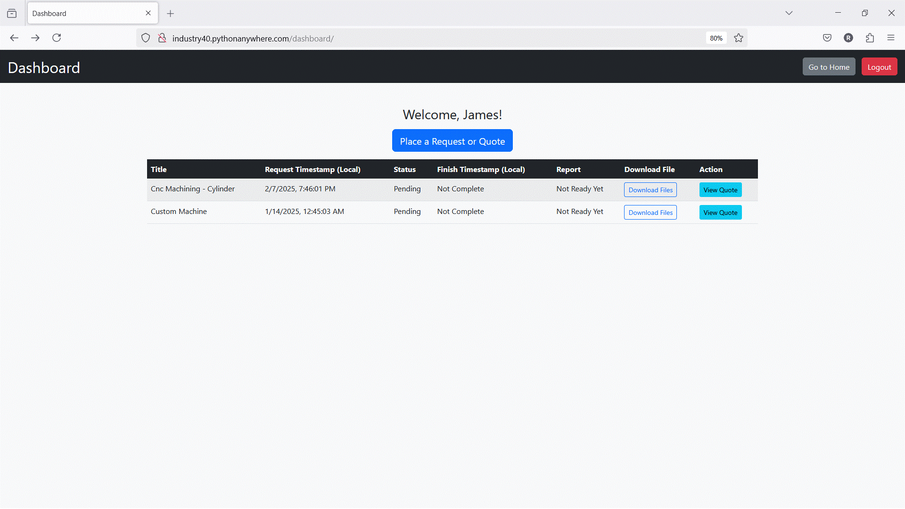

<h1 align="center">☁️ OPC-UA Fusion Cloud Portal 🏭</h1>

<p align="center">
  The customer-facing web application for the <strong>Industry 4.0 Manufacturing Lab</strong>.
</p>
<p align="center">
  <a href="https://www.djangoproject.com/" target="_blank"></a>
<a href="https://www.python.org/" target="_blank"></a>
<a href="https://firebase.google.com/" target="_blank"></a>
  <a href="https://render.com/" target="_blank"></a>
  <a href="#" target="_blank"></a>
</p>

This cloud manufacturing portal is a complementary customer-facing cloud interface for the **[`opcua_fusion`](https://github.com/roshbeng/opcua_fusion.git)** system, allowing customers to register, submit detailed manufacturing quotes, and track the real-time status of their requests.

---

## 🗺️ System Overview

The **OPC-UA Fusion Cloud Portal** is a Django-based web application for cloyd manufacturing serving as the primary point of contact for customers. It provides a user-friendly interface for submitting manufacturing jobs.

Data and files submitted through this portal are stored in **Google Firebase** (Firestore and Cloud Storage). This cloud backend is then accessed by the **[`opcua_fusion`](https://github.com/roshbeng/opcua_fusion.git)** system—an on-premise service that interfaces with manufacturing hardware via OPC UA. The `opcua_fusion` system processes quotes, runs jobs, and updates the status back to the cloud, which clients can view on their dashboard.

## 📸 User Interface Preview

<p align="center">
  
</p>

### ✨ Features

- 🔐 **User Authentication:** Secure user registration and login. New accounts require manual administrator approval.
- 📊 **Client Dashboard:** A personalized dashboard to view submission history, track job status (`Pending`, `In Progress`, `Complete`), and access final reports.
- 📝 **Detailed Quote Form:** A comprehensive form for submitting manufacturing requests, including project details, material, quantity, and more.
- 📤 **File Uploads:** Supports `.zip` uploads for CAD models, technical drawings, and other resources directly to cloud storage.
- 🔥 **Firebase Integration:** Uses Firebase Firestore for the database and Firebase Storage for file uploads, ensuring scalability and reliability.
- 📱 **Responsive Frontend:** Built with Bootstrap 5 for a clean, responsive user experience across all devices.

---

## 🚀 Getting Started

Follow these instructions to get a local copy of the project up and running for development and testing.

### ✅ Prerequisites

- 📦 `pip` and `venv`
- 🔥 A Google Firebase project

### 1. 🔥 Firebase Configuration

1.  **Create a Firebase Project:** Go to the [Firebase Console](https://console.firebase.google.com/) and create a new project.
2.  **Enable Firestore:** In your project, navigate to `Build > Firestore Database` and create a database in **Production mode**.
3.  **Enable Storage:** Navigate to `Build > Storage` and set up Cloud Storage. Note your storage bucket URL (e.g., `your-project-id.appspot.com`).
4.  **Get Service Account Key:**

    - In the Firebase Console, go to `Project Settings` (⚙️) > `Service accounts`.
    - Click **"Generate new private key"**. A JSON file will be downloaded.
    - Place this `serviceAccountKey.json` file in the root directory of the Django project.

    > **⚠️ SECURITY WARNING**
    > The `serviceAccountKey.json` file contains sensitive credentials. **NEVER** commit this file to a public repository. Ensure your `.gitignore` file includes `serviceAccountKey.json`.

### 2. 💻 Local Installation

1.  **Clone the Repository:**

    ```bash
    git clone https://github.com/your-username/opcua_fusion_cloud.git
    cd opcua_fusion_cloud
    ```

2.  **Create and Activate a Virtual Environment:**

    ```bash
    # macOS/Linux
    python3 -m venv venv && source venv/bin/activate

    # Windows
    python -m venv venv && .\venv\Scripts\activate
    ```

3.  **Install Dependencies:**

    ```bash
    pip install -r requirements.txt
    ```

4.  **Set Up Environment Variables:**
    Create a `.env` file in the project's root directory and add your secret key:

    ```env
    # .env
    SECRET_KEY='a-very-secret-and-random-key-for-local-development'
    ```

5.  **Apply Database Migrations:**

    ```bash
    python manage.py migrate
    ```

6.  **Run the Development Server:**
    ```bash
    python manage.py runserver
    ```
    The application will be live at `http://127.0.0.1:8000/`.

---

## 👤 User Account Approval

> **ℹ️ Note:** By default, new users have their `approved` status set to `False`. An administrator must manually approve their account by accessing the Firebase Firestore console and changing the `approved` field to `True` for the corresponding user document in the `users` collection.

---

## 🚢 Deployment to Render

Here is a guide to deploying this application to a cloud platform like **Render**.

### 1️⃣ Prepare for Production

1.  **Update `settings.py`:**
    Modify `opcua_fusion_cloud/settings.py` to handle production environments.

    ```python
    # ...
    # Get SECRET_KEY from environment variable
    SECRET_KEY = os.environ.get('SECRET_KEY')

    # Get DEBUG status from environment variable
    DEBUG = os.environ.get('DEBUG', 'False').lower() in ('true', '1', 't')

    # Set ALLOWED_HOSTS for your domain
    ALLOWED_HOSTS = [os.environ.get('RENDER_EXTERNAL_HOSTNAME'), '127.0.0.1']

    # WhiteNoise Middleware (for serving static files)
    MIDDLEWARE = [
        "django.middleware.security.SecurityMiddleware",
        "whitenoise.middleware.WhiteNoiseMiddleware", # Add this
        # ... rest of middleware
    ]
    # ...
    ```

2.  **Update `views.py` for Firebase Credentials:**
    Modify `user_account/views.py` to securely load Firebase credentials from an environment variable.

    ```python
    # user_account/views.py
    import os
    import json
    import firebase_admin
    # ...

    try:
        firebase_creds_json = os.environ.get("FIREBASE_SERVICE_ACCOUNT_KEY_JSON")
        if firebase_creds_json:
            creds_dict = json.loads(firebase_creds_json)
            cred = credentials.Certificate(creds_dict)
        else: # Fallback for local dev
            cred = credentials.Certificate("serviceAccountKey.json")

        firebase_admin.initialize_app(
            cred, {"storageBucket": "your-bucket-name.appspot.com"}
        )
    except Exception as e:
        print(f"🔥 Firebase initialization failed: {e}")
    ```

### 2️⃣ Deploy to Render

1.  **Create a `build.sh` script:**
    In your project root, create a `build.sh` file. This script automates the build process on Render.

    ```bash
    #!/usr/bin/env bash
    # exit on error
    set -o errexit

    pip install -r requirements.txt
    python manage.py collectstatic --no-input
    python manage.py migrate
    ```

    Make it executable: `chmod +x build.sh`.

2.  **Push to GitHub:** Commit all changes and push them to your repository.

3.  **Create a Web Service on Render:**

    - On your Render Dashboard, click **New > Web Service** and connect your GitHub repo.
    - **Environment:** `Python 3`
    - **Build Command:** `./build.sh`
    - **Start Command:** `gunicorn opcua_fusion_cloud.wsgi:application`

4.  **Add Environment Variables:**
    In the **Environment** tab of your Render service, add the following:

| Variable                            | Description                                        | Example Value                                    |
| ----------------------------------- | -------------------------------------------------- | ------------------------------------------------ |
| `SECRET_KEY`                        | A new, randomly generated strong key.              | `your-production-secret-key`                     |
| `DEBUG`                             | Set to `False` for production.                     | `False`                                          |
| `PYTHON_VERSION`                    | The Python version you are using.                  | `3.11.4`                                         |
| `FIREBASE_SERVICE_ACCOUNT_KEY_JSON` | The **entire content** of `serviceAccountKey.json` | `{"type": "service_account", "project_id": ...}` |

5.  **Deploy!**
    Click **"Create Web Service"**. Render will build and deploy your application, making it live at the URL they provide. 🎉
